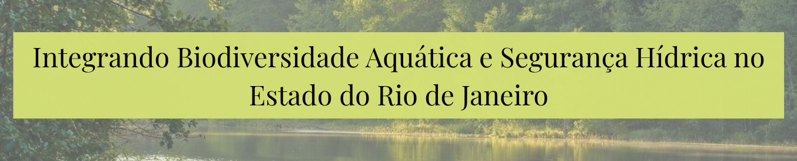

> 
>

---

## :mortar_board: Sobre o Projeto

Este trabalho investiga a relação espacial entre a **biodiversidade aquática** e a **qualidade hídrica** no Estado do Rio de Janeiro, integrando dados georreferenciados de ocorrência de espécies com o Índice de Qualidade da Água (IQA) dos principais mananciais fluminenses.

A hipótese central é que áreas de maior riqueza de espécies aquáticas coincidem com condições favoráveis de qualidade da água e que essa relação, quando mapeada, pode orientar estratégias de conservação e segurança hídrica no estado.

---

## :round_pushpin: Objetivos

- Mapear a distribuição espacial da biodiversidade aquática fluminense (macroinvertebrados e peixes)
- Produzir mapas temáticos e analíticos das ocorrências por Região Hidrográfica (RH)
- Caracterizar espacialmente a qualidade hídrica a partir dos valores de IQA (2016–2024)
- Analisar a relação entre biodiversidade e qualidade da água nas 9 Regiões Hidrográficas do estado

---

## 🗺️ Área de Estudo

**Estado do Rio de Janeiro**, organizado em 9 Regiões Hidrográficas:

| RH | Nome |
|----|------|
| I | Baía da Ilha Grande |
| II | Baía de Guanabara |
| III | Médio Paraíba do Sul |
| IV | Piabanha |
| V | Guandu |
| VI | Dois Rios |
| VII | Lagos São João |
| VIII | Macaé e das Ostras |
| IX | Itabapoana |

---

## 🔬 Metodologia

### Dados de Biodiversidade
- Levantamento de dados secundários nas plataformas **GBIF**, **SiBBr** e **ICMBio**
- Grupos analisados: **insetos aquáticos** (Trichoptera, Ephemeroptera, Plecoptera, Odonata, Diptera, Hemiptera) e **peixes dulcícolas**
- Total de **8.970 registros de ocorrência** após limpeza e tratamento dos dados

### Dados de Qualidade Hídrica
- Série temporal de IQA de **2016 a 2024** fornecida pelo Programa de Saneamento Ambiental (PSAM/RJ)
- **4.251 pontos de monitoramento** distribuídos pelo estado

### Análise Espacial
Processamento realizado no **ArcGIS Pro** com as seguintes técnicas:

| Técnica | Aplicação |
|---------|-----------|
| Mapa de calor (Kernel Density) | Identificação de hotspots de biodiversidade |
| Interpolação por Krigagem | Superfície contínua de qualidade hídrica (IQA) |
| Análise de interseção | Relação entre ocorrências e Unidades de Conservação |

### Análise Estatística

Para investigar a relação entre biodiversidade aquática e qualidade hídrica, foi realizada uma **regressão linear simples** no software **GraphPad Prism**, aplicada individualmente para cada uma das 9 Regiões Hidrográficas.

**Preparação dos dados:**
- A camada de densidade de pontos de biodiversidade (Kernel Density) foi convertida para formato vetorial, gerando uma tabela onde cada linha corresponde a um pixel do estado com valores de gradiente de densidade de 1 a 9
- Esses valores foram **normalizados para o intervalo 0–1** para garantir escala uniforme, sendo usados como **variável independente (eixo X)**
- A camada raster de IQA (gerada pela Krigagem) também foi vetorizada, com os valores de IQA de cada pixel como **variável dependente (eixo Y)**

**Resultados por Região Hidrográfica:**

| RH | Tendência | R² | Interpretação |
|----|-----------|-----|---------------|
| Baía de Guanabara | Positiva fraca | 0,0167 | Alta pressão urbana; biodiversidade reflete esforço amostral intenso, não saúde ecológica |
| Guandu | Negativa fraca | 0,0121 | Presença de espécies tolerantes a ambientes degradados |
| Macaé | Negativa fraca | 0,0562 | Espécies tolerantes podem mascarar impactos da qualidade hídrica |
| Ilha Grande | Negativa fraca | 0,0367 | Baixa amostragem de ocorrências pode não capturar a real relação |
| Itabapoana | Negativa fraca | 0,0207 | Fatores ecológicos além da qualidade hídrica estruturam as comunidades |
| Dois Rios | Neutra | 0,0002 | Ausência de correlação; escassez de dados de IQA na região |
| Médio Paraíba | **Positiva moderada** | **0,2152** | Maior biodiversidade associada a melhor qualidade hídrica; papel das áreas protegidas (ex: P.N. Itatiaia) |
| Piabanha | Positiva fraca | 0,0205 | Tendência positiva, mas correlação linear ainda fraca |
| Lagos de São João | **Positiva forte** | **0,4089** | Relação mais expressiva entre boa qualidade hídrica e riqueza de espécies |

> A variabilidade entre as RHs evidencia que a relação entre IQA e biodiversidade é moldada por **contextos locais específicos**, e não segue um padrão único em escala estadual.

---

## 🗂️ Estrutura do Repositório

```
📁 dados/
   ├── ocorrencias_biodiversidade.csv   # Registros de ocorrência (8.970 pontos)
   └── iqa_mananciais_2016_2024.csv     # Índice de Qualidade Hídrica
📁 mapas/
   ├── fig1_regioes_hidrograficas.jpg
   ├── fig2_macroinvertebrados_RH.jpg
   ├── fig3_peixes_dulcicolas.jpg
   ├── fig4_densidade_biodiversidade.jpg
   ├── fig5_unidades_conservacao.png
   ├── fig6_iqa_tematico.jpg
   ├── fig7_krigagem_iqa_biodiversidade.png
   └── fig8_graficos_regressao_por_RH.png
📁 tabelas/
   └── tabela_especies_por_RH.png

```

---

## 📊 Principais Resultados

- **48% dos registros de biodiversidade** estão dentro de Unidades de Conservação, evidenciando o papel crucial das áreas protegidas
- A **RH Baía de Guanabara** concentra o maior número de registros, porém apresenta o **pior IQA médio (31,5)** — qualidade "ruim"
- As RHs de **Ilha Grande** e **Macaé** apresentam os melhores índices de qualidade hídrica (IQA 68,1 e 65,8)
- A análise de regressão revelou padrões **heterogêneos entre as RHs**, com R² variando de 0,0002 (Dois Rios) a 0,4089 (Lagos de São João)
- As RHs com **correlação positiva mais forte** (Médio Paraíba e Lagos de São João) coincidem com maior presença de Unidades de Conservação
- O grupo **EPT** (Ephemeroptera, Plecoptera e Trichoptera) mostrou-se um forte bioindicador, com maior diversidade nas RHs de melhor qualidade hídrica

---

## 🗺️ Mapas

**Regiões Hidrograficas do Estado do Rio de Janeiro**
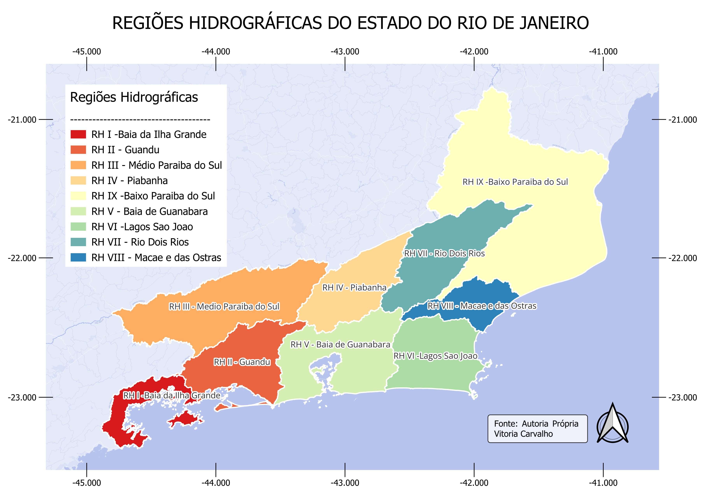

**Distribuição de Insetos Aquáticos por RH**  
*Distribuição de Insetos Aquaticos em Itapaboana* 

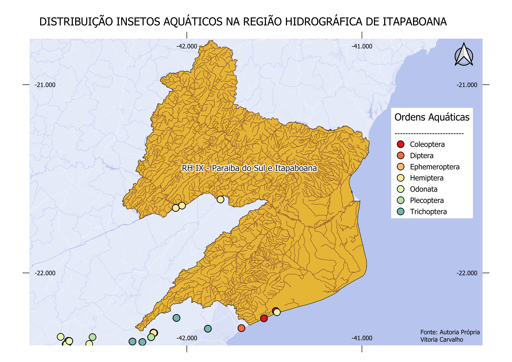

*Distribuição de Insetos Aquáticos em Dois Rios*
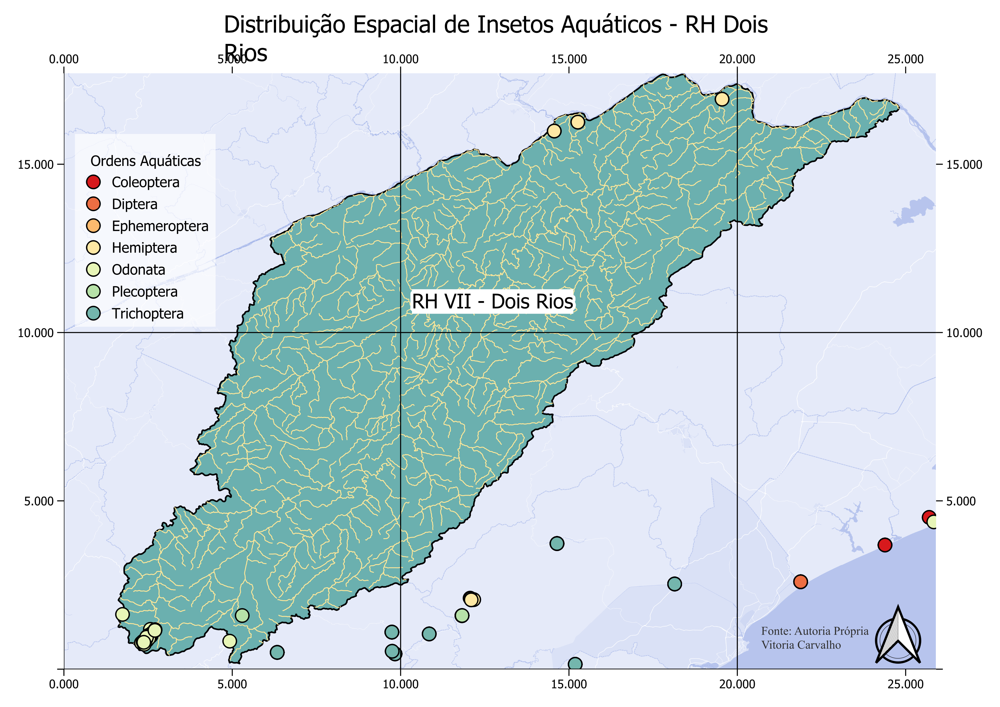 

*Distribuição de Insetos Aquáticos em Ilha Grande*
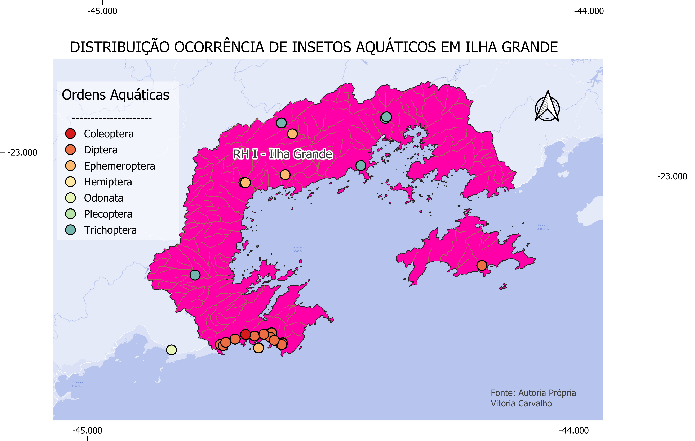

*Distribuição de Insetos Aquáticos em Guandu* 
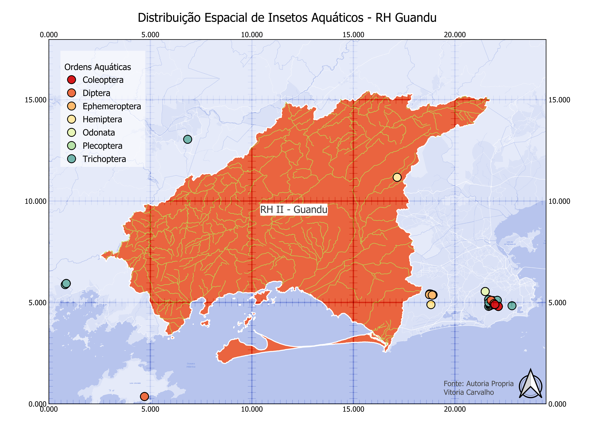 

*Distribuição de Insetos Aquáticos em Piabanha* 
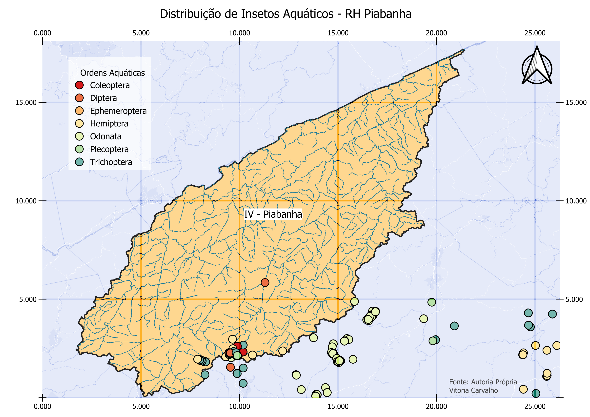

*Distribuição de Insetos Aquáticos em Médio Paraiba do Sul*
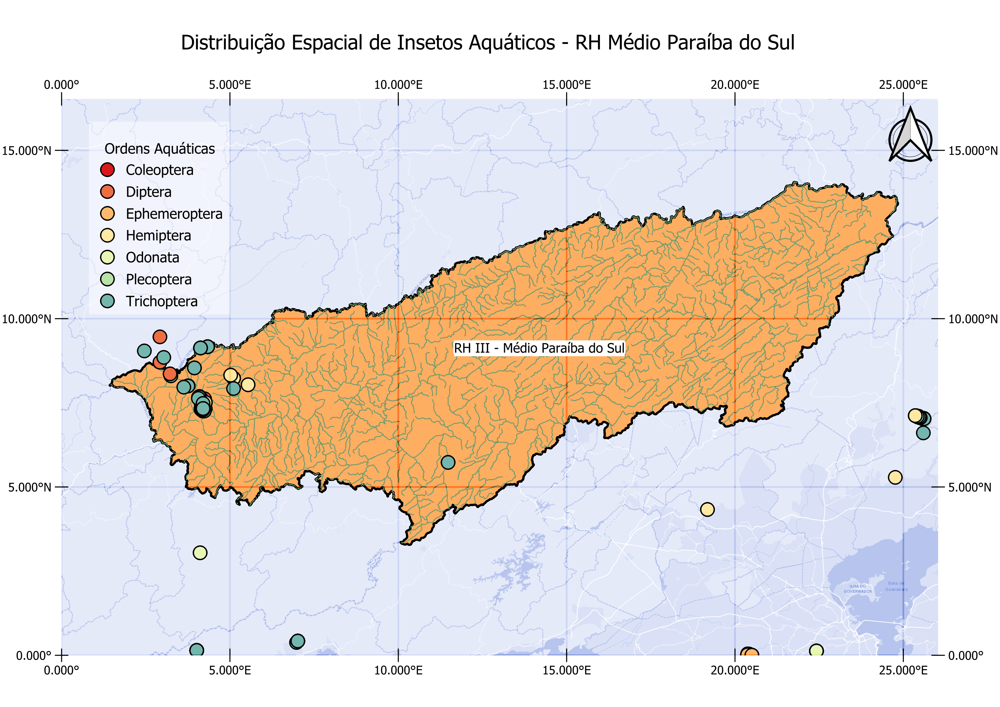 

*Distribuição de Insetos Aquáticos em Macaé*
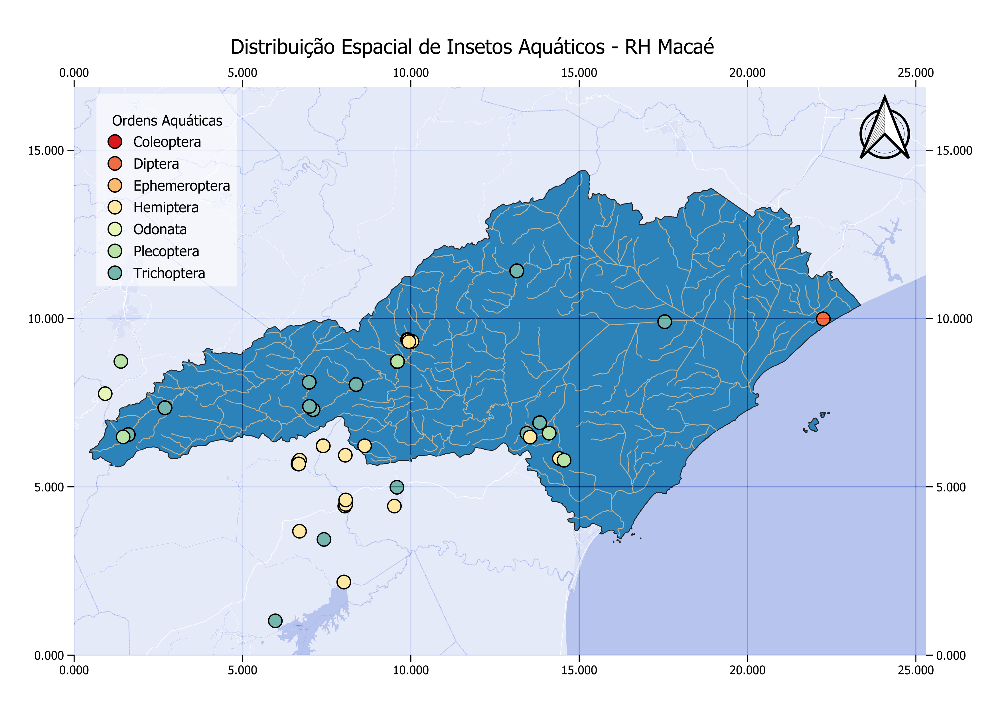 

*Distribuição de Insetos Aquáticos em Baia de Guanabara*
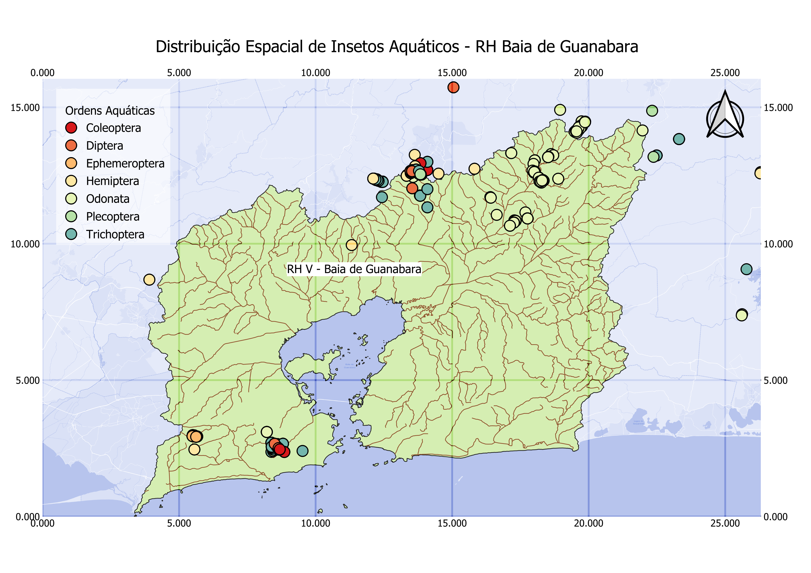

*Distribuição de Insetos Aquáticos em Lagos de São João* 
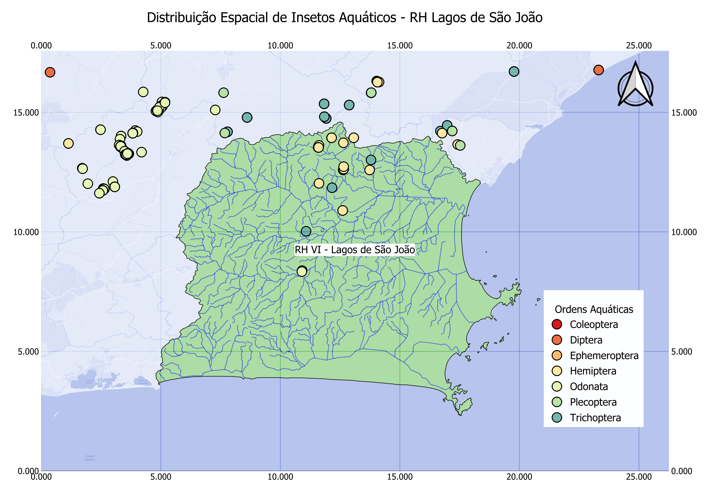 


**Densidade de ocorrências da biodiversidade aquática**  


**Integração entre IQA (Krigagem) e Biodiversidade Aquática**  


**Gráficos de regressão linear por Região Hidrográfica**  


---

## 🛠️ Ferramentas Utilizadas


- **ArcGIS Pro** — análise espacial, mapas temáticos, krigagem e densidade de pontos
- **GraphPad Prism** — regressão linear simples por Região Hidrográfica
- **Excel** — organização, limpeza e tratamento dos dados tabulares
- **GBIF / SiBBr / ICMBio** — plataformas de dados de biodiversidade

---

## 👩‍🎓 Autora

**Vitoria Barbosa Barcellos de Carvalho**  
Bacharel em Ciências Biológicas — UERJ  
Instituto de Biologia Roberto Alcântara Gomes

**Orientadora:** Profa. Dra. Aliny P. F. Pires  
**Coorientadora:** MSc. Stephanie Vaz

---

## 📄 Citação

```
CARVALHO, Vitoria Barbosa Barcellos de. Integrando Biodiversidade Aquática e 
Segurança Hídrica no Estado do Rio de Janeiro. 2025. Monografia (Bacharelado em 
Ciências Biológicas) — Instituto de Biologia Roberto Alcântara Gomes, 
Universidade do Estado do Rio de Janeiro, Rio de Janeiro, 2025.
```

---

*Trabalho desenvolvido no Laboratório de Ecologia e Conservação de Ecossistemas — UERJ*
